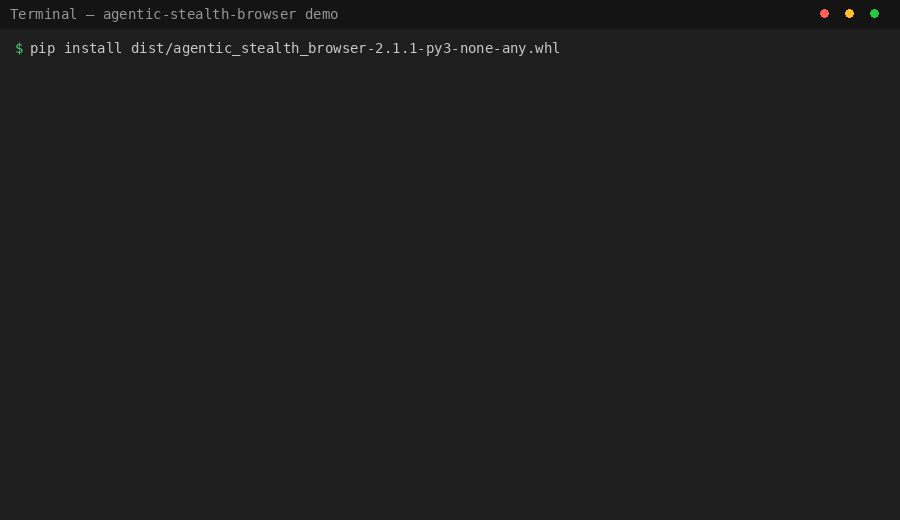

# Agentic Stealth Browser

**Playwright gets detected. This doesn't.**

[](https://github.com/shanewas/agentic-stealth-browser/actions/workflows/ci.yml)
[](LICENSE)
[](https://www.python.org/downloads/)
[](https://pypi.org/project/agentic-stealth-browser/)
[](tests/)

<p align="center">
  
</p>

Production-grade stealth browser automation that **survives Cloudflare, LinkedIn, Amazon, and other anti-bot systems** by looking convincingly human at every layer.

```bash
pip install agentic-stealth-browser
playwright install --with-deps chromium
```

```python
from core.agent_browser import AgentBrowser

async with AgentBrowser(session_name="demo") as browser:
    await browser.launch(headless=True)
    await browser.safe_goto("https://bot.sannysoft.com")
    # ✓ passes WebGL, Canvas, AudioContext, WebRTC, and TLS fingerprinting
```

---

## Why vanilla Playwright fails

Sites don't just check your User-Agent anymore. They check *everything*:

| Attack Surface | Vanilla Playwright | This library |
|---|---|---|
| **TLS handshake** (JA3/JA4 fingerprint) | Standard Python TLS — instantly identifiable | Region-spoofed profiles (US, Japan, EU, Korea) |
| **Navigator APIs** (`navigator.webdriver`, `plugins`, `languages`) | Leaks automation flags everywhere | Every property patched before first paint |
| **WebGL / Canvas fingerprint** | Headless GPU renders differently | Consistent buffers across sessions |
| **Human behavior** | Robotic clicks, instant typing | Bézier mouse curves, variable speed, fatigue simulation |
| **Auto-recovery** | None — blocks = failure | CAPTCHA detection → proxy rotation → retry chain |
| **Account warming** | Nothing | 14-day graduated ramp-up per account |

Result: **passes bot.sannysoft.com, pixelscan.net, and CreepJS** with zero flags in headless mode.

---

## Quick Start

### CLI (easiest)

```bash
# Health check + stealth fingerprint test
stealth-browser health --preset linkedin_2026 --region us

# Start the operator dashboard
agentic-stealth-browser dashboard
```

### Python SDK

```python
from core.agent_browser import AgentBrowser

async with AgentBrowser(
    session_name="my-session",
    region="japan",
    headless=True
) as browser:
    await browser.launch()
    await browser.safe_goto("https://example.com")
    # TLS-spoofed, no webdriver leak, human-like interaction ready
```

### MCP (for AI agent clients)

```json
{
  "mcpServers": {
    "stealth-browser": {
      "command": "python",
      "args": ["-m", "production.mcp_server"]
    }
  }
}
```

Then: `stealth_launch` → `stealth_navigate` → `stealth_scrape` → `stealth_close`.

---

## Key Features

| Feature | What It Does |
|---|---|
| **TLS Fingerprinting** | JA3/JA4 region profiles |
| **Human Behavior** | Mouse wobble, typing mistakes, fatigue, distraction |
| **Auto Recovery** | Block detection → proxy/session rotation → retry |
| **Account Warming** | 14-day gradual ramp-up for new accounts |
| **Workflow Orchestrator** | Queue, schedule, domain concurrency, retries, persistence |
| **Python SDK** | `StealthClient` — async API without MCP |
| **Security Governance** | Input validation, session isolation, policy engine, approval gates |
| **Adaptive Stealth** | Per-domain behavior profiles with FeedbackStore telemetry |
| **Plugin System** | Lifecycle hooks via `BasePlugin` |
| **Operator Dashboard** | Live DevTools, CAPTCHA intervention, workflow recording |
| **Feature Flags** | Runtime capability discovery per browser backend |
| **Performance Profiling** | Timing decorators + `perf_benchmark.py` |

---

## Full Documentation

- **Workflow System** — record real browser actions via CDP, replay as YAML (13 step types)
- **Operator Dashboard** — Grok/X-inspired dark UI, live browser view, CAPTCHA solving, workflow recording
- **Orchestrator** — queue, schedule, chain workflows with domain-aware concurrency
- **Security** — input validation, session isolation, policy engine, approval gates
- **SDK** — `StealthClient` async API without MCP
- **Plugins** — lifecycle hooks for custom behavior
- **VPS Deployment** — systemd, Caddy reverse proxy, Cloudflare Tunnel patterns
- **Migration v1 → v2** — deprecation shims, migration guide, script

See sections below for each topic. For release history: [CHANGELOG.md](CHANGELOG.md).

---

## Project Structure

```
├── core/           AgentBrowser, connection pool, session checkpoints
├── stealth/        TLS, scripts, Firefox adapter, caching
├── behavior/       Human simulation, personas, adaptive tuning
├── recovery/       Anti-block orchestrator
├── workflows/      Recorder, player, schema, library
├── production/     MCP server, SDK, orchestrator, security, profiler
├── plugins/        Plugin system with template
├── scripts/        Migration, evaluation, benchmarking
└── tests/          880+ contract + integration tests
```

## License

MIT. See [LICENSE](LICENSE) and [CHANGELOG.md](CHANGELOG.md).
