# Agentic Stealth Browser

Production-grade, human-mimicking browser automation framework for autonomous agents. Built to survive modern anti-bot systems (Cloudflare, LinkedIn, Amazon, Upwork, etc.).

**Repository:** https://github.com/shanewas/agentic-stealth-browser

---

## Current Status (May 2026)

**Maturity:** Mid Implementation — Phase 8 P1 campaign largely complete (reliability, MCP, CI, recovery, persona foundation closed)

This project has a **solid architectural base** but is not yet production-hardened. The main `AgentBrowser` class integrates stealth, human behavior, recovery, proxy, and sessions. Several critical pieces are implemented, while others remain partial or untested at scale.

### What's Working Well

- **Core AgentBrowser** (`core/agent_browser.py`)
  - Persistent context launch with realistic viewport, locale, timezone
  - Full stealth script injection (`advanced_stealth.py`)
  - TLS fingerprint manager wired in
  - Human behavior + orchestration layer attached
  - Recovery orchestrator, scraper, AI hooks, proxy, and session manager initialized

- **Stealth Layer**
  - Region-aware TLS fingerprint profiles (US, Japan, EU, Korea, Global)
  - Advanced stealth script (canvas, WebGL, AudioContext, WebRTC, permissions spoofing)
  - Custom HTTP headers

- **Anti-Block Recovery** (`recovery/anti_block_orchestrator.py`)
  - `AntiBlockOrchestrator` with clear `BlockType` enum (CAPTCHA, soft/hard rate limit, account restriction, proxy block, etc.)
  - `RecoveryContext` dataclass for tracking attempts and metadata

- **Human Behavior** (`behavior/human_behavior.py`)
  - Realistic typing with occasional pauses and corrections
  - Thinking delays (`think()`)

- **Infrastructure**
  - `SessionManager` with anonymous/persistent sessions
  - `ProxyManager` with Decodo sticky session support
  - Basic audit logging and AI hooks

- **MCP Integration**
  - Solid: Full stealth-playwright-mcp with debug/preset/explain/health tools, recovery wiring, correct .page usage (fixed #106 browser.browser). Used in Hermes.

### What's Incomplete or Weak

| Area                        | Status          | Notes |
|----------------------------|-----------------|-------|
| **Proxy Execution**        | Partial         | Manager exists but real connection testing + fallback logic is minimal |
| **Recovery Integration**   | Good (Phase 8)  | `safe_goto`, StealthScraper, MCP paths wired to AntiBlockOrchestrator + circuit breaker. #105 #130 etc closed |
| **Human Behavior Depth**   | Basic           | Typing + think delays present. Missing realistic mouse trajectories, scroll heatmaps, viewport jitter, idle patterns |
| **TLS Fingerprinting**     | Good start      | Launch args + profiles exist. True low-level ClientHello spoofing is limited in stock Playwright |
| **Detection Testing**      | Manual          | Basic test scripts exist. No automated "detection score" runner against live protected sites |
| **Cookie & Login Resilience** | Good        | load_cookies + warm_up + safe_goto examples + MCP support documented. Resilience improved (#145 #134) |
| **Multi-Agent Orchestration** | Early      | SessionManager exists but high-level agent coordination / rotation is thin |
| **Error Handling & Logging** | Moderate     | Audit logger present but not comprehensive across all failure paths |
| **Documentation**          | Improved (Phase 8) | README has recipes, anti-patterns (#209 #133), API tables, cookie/warm-up flows (#118). More examples in progress |

### Overall Assessment

**Strengths:**
- Clean modular architecture (stealth / recovery / behavior / proxy / sessions)
- Good foundation for region-specific fingerprinting
- Recovery model is well thought out on paper

**Risks / Gaps:**
- Many P1s closed; remaining focus on perf/scalability and full E2E coverage (see open P1s)
- Real-world survival rate against aggressive detectors (especially LinkedIn, Amazon JP, Cloudflare) is unknown
- Human mimicry is still relatively shallow
- Proxy + recovery loop is not yet battle-hardened

---

## Roadmap

### Next Priorities (Iteration 4–5)

1. **Deep Recovery Integration**
   - Wire `AntiBlockOrchestrator` into all navigation and interaction methods
   - Implement exponential backoff + proxy rotation on block detection

2. **Advanced Human Behavior**
   - Realistic mouse movement paths (Bézier curves, natural acceleration)
   - Scroll pattern simulation
   - Idle behavior + micro-movements

3. **Proxy Hardening**
   - Actual connection testing + automatic fallback
   - Residential proxy rotation strategies

4. **Detection Evaluation Suite**
   - Automated tests against real Cloudflare / LinkedIn / Amazon challenges
   - Fingerprinting scorecard (TLS, canvas, WebGL, fonts, etc.)

5. **MCP Tool Polish**
   - Full `stealth_navigate` with recovery
   - Cookie loading from real browser exports
   - Region switching at runtime

6. **Documentation & Examples**
   - Architecture diagram
   - Usage examples for Upwork / LinkedIn scraping
   - Configuration guide

---

## Quick Start (via MCP)

```bash
python3 /root/.hermes/skills/stealth-playwright-mcp/server.py
```

Then use tools:
- `stealth_launch`
- `stealth_navigate`
- `stealth_load_cookies`
- `stealth_set_region`
- `stealth_scrape`

---


## Architecture Overview

```mermaid
graph TD
    A[AgentBrowser] --> B[Stealth Layer]
    A --> C[Human Behavior]
    A --> D[Recovery Orchestrator]
    A --> E[Proxy Manager]
    A --> F[Session Manager]
    A --> G[Cookie Manager]
    
    B --> H[TLS Fingerprinting]
    B --> I[Advanced Stealth Script]
    B --> J[Header Spoofing]
    
    C --> K[Mouse Movement]
    C --> L[Typing Simulation]
    C --> M[Scroll Patterns]
    C --> N[Idle Behavior]
    
    D --> O[Block Detection]
    D --> P[Backoff Strategy]
    D --> Q[Session/Proxy Rotation]
    
    E --> R[Decodo Residential]
    E --> S[Sticky Sessions]
    
    F --> T[Multi-Session Management]
    G --> U[Cookie Manager]
    
    V[Detection Testing] --> W[Fingerprint Scorecard]
    V --> X[Real Site Testing]
    
    style A fill:#f9f,stroke:#333
    style D fill:#bbf,stroke:#333
```



**Core Components:**
- **Stealth Layer**: TLS fingerprinting + advanced script injection
- **Human Behavior**: Natural mouse, typing, scrolling, idle patterns
- **Recovery**: Intelligent block detection and automatic rotation
- **Proxy/Session**: Residential proxy + resilient session management


## Usage Examples

### Basic Stealth Navigation

```python
from core.agent_browser import AgentBrowser

async def basic_example():
    browser = AgentBrowser(session_name="example")
    await browser.launch(headless=True)
    
    # Navigate with full stealth + recovery
    await browser.safe_goto("https://www.linkedin.com/in/williamhgates", platform="linkedin")
    
    # Human-like behavior
    await browser.human.scroll_naturally(400)
    await browser.human.think(1500, 2800)
    
    await browser.close()
```

### Loading Cookies from Real Browser (Recommended for Upwork/LinkedIn)

```python
async def with_cookies():
    browser = AgentBrowser(session_name="upwork-session")
    await browser.launch(headless=True)
    
    # Load cookies exported from real Edge/Chrome
    await browser.load_cookies_from_file("~/.upwork/cookies.json")
    
    # Warm up the session
    await browser.warm_up_before_work(intensity="medium")
    
    # Now perform actions with fresh cookies + human behavior
    await browser.safe_goto("https://www.upwork.com/nx/search/jobs/", platform="upwork")
    await browser.human.simulate_reading(8.0)
    
    await browser.close()
```

### Region-Specific Fingerprinting

```python
from stealth.tls_fingerprint import get_tls_manager

# Use Japanese TLS fingerprint
tls = get_tls_manager("japan")
tls.log_fingerprint_choice()
```

### Detection Testing

```python
from tests.detection_runner import DetectionTester

tester = DetectionTester()
await tester.run_full_suite()
tester.save_results()
```


## Configuration Reference

### Environment Variables

| Variable              | Description                        | Default     |
|-----------------------|------------------------------------|-------------|
| `STEALTH_REGION`      | TLS fingerprint region             | `japan`     |
| `STEALTH_HEADLESS`    | Run browser in headless mode       | `true`      |
| `STEALTH_PROXY`       | Use residential proxy              | `false`     |

### Recommended Settings

```python
# For maximum stealth (LinkedIn / Upwork)
browser = AgentBrowser(session_name="production")
await browser.launch(headless=True)
await browser.load_cookies_from_file("cookies.json")
await browser.warm_up_before_work("heavy")
await browser.ensure_cookies_fresh(max_age_hours=6)
```


## API Reference

### Core Methods

| Method                        | Description                              | Parameters |
|-------------------------------|------------------------------------------|----------|
| `launch(..., light_mode=False)` | Launch browser with stealth (#174/#113: light_mode reduces launch/warm-up cost/latency) | `headless`, `slow_mo`, `light_mode`, `persona` |
| `safe_goto(url, platform)`    | Navigate with recovery                   | `url`, `platform`, `warm_up` |
| `load_cookies_from_file(path)`| Load cookies from real browser           | `cookies_path` |
| `warm_up_before_work(intensity)` | Perform natural warm-up               | `intensity` ("light", "medium", "heavy") |
| `ensure_cookies_fresh(hours)` | Auto-refresh cookies if needed           | `max_age_hours` |

### Human Behavior Methods

| Method                        | Description                              |
|-------------------------------|------------------------------------------|
| `move_mouse_naturally(x, y)`  | Bézier curve mouse movement              |
| `human_click(selector)`       | Natural click with micro-corrections     |
| `type_like_human(selector, text)` | Human-like typing with mistakes      |
| `scroll_naturally(pixels)`    | Variable speed scrolling                 |
| `simulate_reading(seconds)`   | Reading simulation with re-reads         |
| `fake_search_action(query)`   | Simulate search behavior                 |
| `random_idle_behavior(seconds)` | Advanced idle patterns                 |

### Recovery & Proxy

| Method                        | Description                              |
|-------------------------------|------------------------------------------|
| `safe_goto` / `safe_click`    | Actions with automatic recovery          |
| `ensure_fresh_cookies(hours)` | Auto cookie refresh                      |
| `warm_up_session(intensity)`  | Session warm-up before work              |


## License

Private repository. All rights reserved.

---

*Last updated: May 2026*
## Troubleshooting & Common Block Reasons (P1 #133)

This section addresses the most frequent reasons accounts get blocked and concrete steps to resolve them.

### Top Block Causes & Immediate Fixes
1. **Missing or stale cookies** — Always load fresh cookies from a real browser profile for the target account. Use `load_cookies` + `warm_up_session`.
2. **No warm-up** — Sites flag "cold" sessions. Call `warm_up_session(medium)` before any high-value action.
3. **Too fast / robotic** — Use `human.think()`, natural mouse/typing/scroll everywhere. Never use `page.goto` directly.
4. **Proxy / IP reputation** — Rotate residential proxies per account. Never share proxies across high-risk accounts.
5. **TLS / fingerprint mismatch** — Always use region-aligned TLS profile via `set_region` or launch config.
6. **Repeated failures on same domain** — The orchestrator now has circuit breaker (v2). Back off or rotate account.

See also the new `recovery/explain_why_blocked` helper (added Phase 8) for automated diagnosis after a failure.

## Anti-Patterns & Common Mistakes (P1 #209)

**Never do these** (they are the #1 cause of blocks in the wild):

- Launch browser → immediately `goto` target site with no warm-up or human simulation.
- Use the same fingerprint / proxy / persona for 50+ accounts.
- Ignore rate limit signals and hammer retries without backoff + rotation.
- Call low-level Playwright methods (`page.click`, `page.fill`) bypassing the `human` and recovery layers.
- Store raw unencrypted cookies or session state on disk with world-readable perms.
- Run many concurrent browsers without resource backpressure or isolation (see performance guidance).
- Skip the `AntiBlockOrchestrator` or `safe_*` wrappers for "speed".
- Use datacenter proxies on LinkedIn/Amazon/Cloudflare-protected flows.
- Forget to handle `context` vs `page` (fixed in Phase 7/8 but still common copy-paste error).

**Recommended flow for any new platform (2026 LinkedIn example):**
```python
browser = AgentBrowser(...)
await browser.launch(region="us", cookies_path="linkedin.json")
await browser.warm_up_session("medium")
await browser.safe_goto("https://www.linkedin.com/feed/")
# then human.* actions + recovery-aware paths only
```

Following the patterns above + using the new debug/explain tools dramatically improves survival rates.

*These docs close P1 documentation gaps #133 and #209.*

## Recommended Production Flow (P1 #118)

For maximum success rate on protected sites (LinkedIn, Upwork, etc.) always use this pattern:

```python
from core.agent_browser import AgentBrowser

async def production_flow():
    browser = AgentBrowser(
        session_name="linkedin-pro",
        anonymous=False  # for cookie persistence
    )
    await browser.launch(headless=True, region="us", preset="linkedin_2026")

    # 1. Load real cookies exported from your browser (critical!)
    await browser.load_cookies_from_file("~/.linkedin/cookies.json")

    # 2. Warm up the session with human-like behavior
    await browser.warm_up_before_work(intensity="heavy")

    # 3. Use safe navigation with built-in recovery
    success = await browser.safe_goto(
        "https://www.linkedin.com/in/target-profile",
        platform="linkedin"
    )
    if not success:
        # recovery already attempted internally
        pass

    # 4. Perform human-like actions
    await browser.human.simulate_reading(12.0)
    await browser.human.think(800, 2200)

    # 5. Always clean up
    await browser.close()
```

This flow (cookies + warm-up + safe_goto + recovery) dramatically improves survival rates.

## Platform Recipes & Cookbook (P1 #189)

### LinkedIn Profile Scrape (2026)
```python
browser = AgentBrowser(session_name="li")
await browser.launch(preset="linkedin_2026")
await browser.load_cookies_from_file("li_cookies.json")
await browser.warm_up_before_work("heavy")
await browser.safe_goto("https://www.linkedin.com/in/williamhgates", platform="linkedin")
html = await browser.page.content()
# ... parse
await browser.close()
```

### Upwork Job Search
```python
browser = AgentBrowser(session_name="upwork")
await browser.launch(preset="upwork_2026", region="us")
await browser.load_cookies_from_file("upwork_cookies.json")
await browser.warm_up_before_work("medium")
await browser.safe_goto("https://www.upwork.com/nx/search/jobs/", platform="upwork")
# interact with search, apply filters human-like
await browser.close()
```

### Amazon Product Research (stealth)
Use `preset="amazon_2026"`, light warm-up, residential proxy.

### Cloudflare Bypass Flow
Heavy stealth + TLS US, minimal behavior, multiple recovery retries built-in via safe_goto.

See also: `examples/recipes/` (to be expanded) and `stealth/presets.py` for full list.
